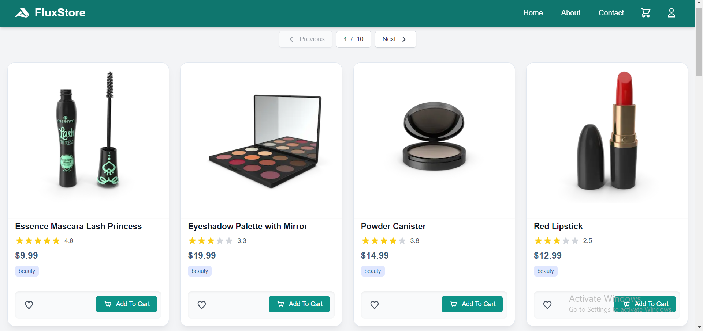
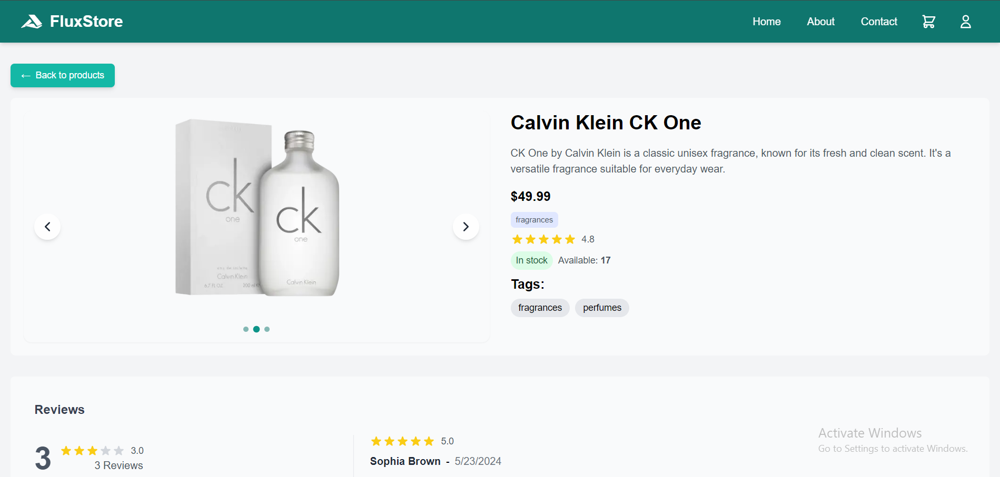
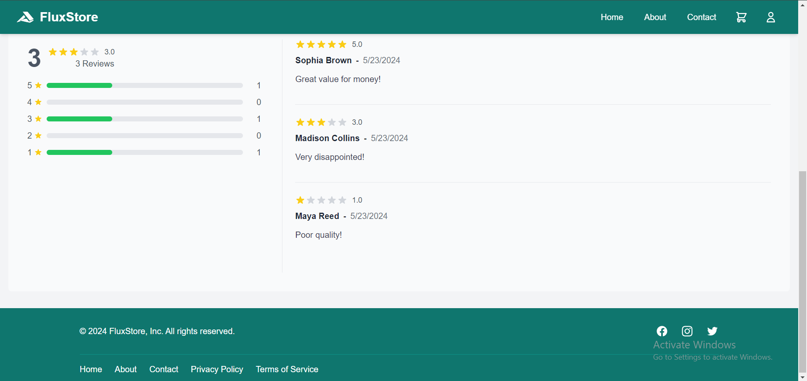

# FluxStore

## Introduction

FluxStore is a modern, feature-rich e-commerce application built with Next.js. It showcases a variety of products, allowing users to browse through a catalog, view detailed product information, and navigate through multiple pages of products. The store is designed with performance, scalability, and user experience in mind, leveraging the power of Next.js for server-side rendering and optimized client-side navigation.





## Key Features

- Responsive product grid layout displaying 20 products per page
- Detailed product pages with image galleries and preview controls
- Pagination for browsing multiple pages of products
- Server-side rendering for improved performance and SEO
- Optimized image loading with Next.js Image component
- Error handling and fallback UI for robust user experience
- Product categorization and tagging
- User reviews and ratings
- Stock and availability information

## Technologies Used

- **Next.js**: A React framework for production-grade applications with server-side rendering and routing capabilities.
- **React**: A JavaScript library for building user interfaces.
- **JavaScript**: The primary programming language used for both front-end and back-end logic.
- **Tailwind CSS**: A utility-first CSS framework for rapidly building custom user interfaces.
- **next/image**: Next.js's built-in Image component for optimized image loading and rendering.

## Setup Instructions

1. **Clone the repository**

   ```
   git clone https://github.com/MohauMushi/MOHMUS379_JSE2407_GroupA_Mohau-Mushi_FSJ01.git
   ```

2. Navigate to the project directory:

   ```
   cd MOHMUS379_JSE2407_GroupA_Mohau-Mushi_FSJ01
   ```

3. **Install dependencies**

   ```
   npm install
   ```

4. **Run the development server**
   ```
   npm run dev
   ```
   The application should now be running on `http://localhost:3000`.

## Usage Examples

### Viewing Products

- Navigate to the home page to see a grid of 20 products.
- Use the pagination controls at the Top/bottom of the page to navigate between different pages of products.

### Viewing Product Details

- Click on any product card to view its detailed information.
- On the detailed product page, you'll find:
  - Product title and description
  - Image gallery with navigation controls
  - Price and category
  - Associated tags
  - Rating and stock information
  - User reviews with reviewer name, date, comment, and rating

### Navigating the Application

- Use the navigation controls to move between the product grid and individual product pages.
- The app URL will update to reflect the current page you're viewing.

## Developer Information

### Fetching Products

- The first 20 products are fetched from `https://next-ecommerce-api.vercel.app/products`.
- Subsequent pages of 20 products are fetched as users navigate.
- Implement skipping to fetch only necessary product data for the current page.

### Error Handling

- Errors during product data fetching are handled gracefully.
- User-friendly error messages are displayed if products or individual product data fails to load.

### Server-Side Rendering

- Product data is rendered on the server using Next.js server components.
- Individual product data is loaded via fetch from individual product endpoints.

### Loading States

- Implement loading states while new data is being fetched.

## Contributing

Contributions to this project are welcome! Please follow these steps to contribute:

1. Fork the repository
2. Create a new branch for your feature (`git checkout -b feature/AmazingFeature`)
3. Commit your changes (`git commit -m 'Add some AmazingFeature'`)
4. Push to the branch (`git push origin feature/AmazingFeature`)
5. Open a Pull Request

## Author

**_MOHAU MUSHI_**
